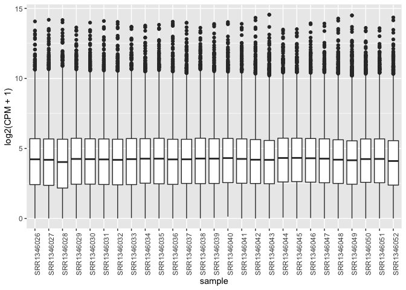
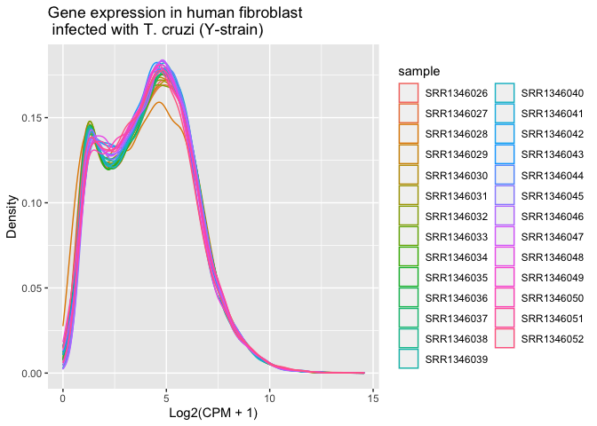
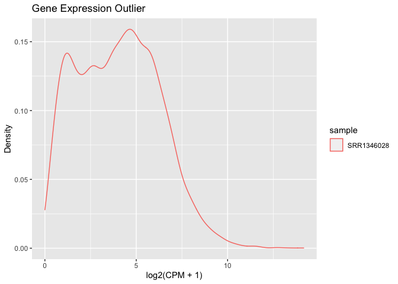
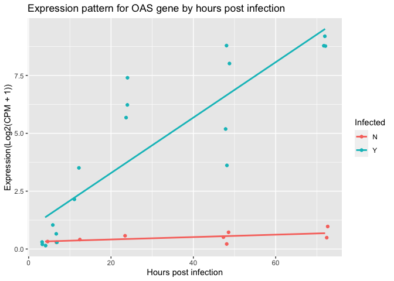
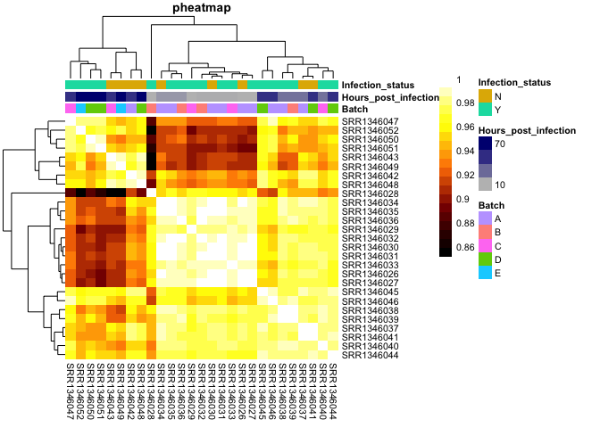
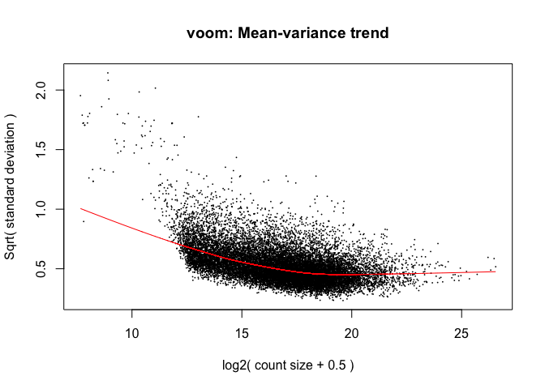
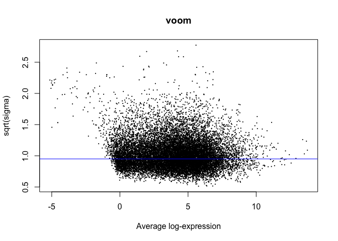

‘Downstream’ Analysis: from counts to Differential Expression
================
Ekpereka Amutaigwe

**Reminder:** When answering the questions, it is not sufficient to
provide only code. Add explanatory text to interpret your results
throughout.

### Background

The dataset used for this assignment has been published by [Li et al. in
2016](https://journals.plos.org/plospathogens/article?id=10.1371/journal.ppat.1005511),
as well as included in a follow-up study by [Houston-Ludlam et al. also
in
2016](https://journals.plos.org/plosone/article?id=10.1371/journal.pone.0159197).
You should recognize the follow-up study, “Comparative Transcriptome
Profiling of Human Foreskin Fibroblasts Infected with the Sylvio and Y
Strains of Trypanosoma cruzi” as this is the paper you were asked to
review for the Paper Critique. The data used in this follow-up study was
a combination of newly generated data (for the Sylvio strain and one
replicate of Y strain), as well as the data generated in the original Li
et al. article (all for the Y strain). In this assignment, you’ll be
working with the Y strain data generated in the original article.

Although the processed data for this study are not available in GEO, the
*raw* RNA-Seq reads have been submitted to NCBI SRA under the accession
[SRP043008](https://trace.ncbi.nlm.nih.gov/Traces/sra/?study=SRP043008).
Fortunately, they have also been preprocessed using a standardized
pipeline from raw reads to mapped gene and transcript level counts, and
formatted into `RangedSummarizedExperiment` objects (ready for analysis
in R!) as part of the [Recount2
project](https://jhubiostatistics.shinyapps.io/recount/). The
`RangedSummarizedExperiment` experiment class functions much the same as
the `SummarizedExperiment` class we learned about in lecture. We can
read the data into R in this format using the [recount
package](https://bioconductor.org/packages/release/bioc/html/recount.html).

We can also get metadata (mapping of sample IDs to time points,
infection status, batch, etc) from [Table
S1](https://journals.plos.org/plospathogens/article/file?type=supplementary&id=info:doi/10.1371/journal.ppat.1005511.s011)
in the original study.

Some helper code to read the data in is provided.

### Load libraries

Note: only a few libraries are provided for the initial steps; add
additional libraries as needed for the rest of the analyses.

``` r
library(recount)
library(openxlsx)
library(tidyverse)
library(edgeR)
library(pheatmap)
```

### Question 1: Importing the data and getting familiar with it (3 POINTS)

-   First, we’ll download and read the gene-level counts
    `RangedSummarizedExperiment` object for project id “SRP043008” into
    R using the `recount` package. We’ll add a column called `sample` to
    the `colData` slot that contains the `run` variable (since this will
    serve as our sample ID and is easier). And we’ll also add the sample
    IDs to the colnames of the object. Note that there’s nothing you
    need to add here.

``` r
download_study(project="SRP043008")
```

    ## 2022-02-28 16:15:44 downloading file rse_gene.Rdata to SRP043008

``` r
load(file.path("SRP043008", "rse_gene.Rdata"))
colData(rse_gene)$sample <- colData(rse_gene)$run
colnames(rse_gene) <- colData(rse_gene)$sample
```

-   Now we’ll add sample IDs to the `colnames` of the object to the SRR
    sample IDs: Use the IDs in the `run` variable of the `colData` slot.
    Note that there’s nothing you need to add here.

``` r
colnames(rse_gene) <- colData(rse_gene)$sample
```

-   Investigate the object just loaded. How many genes are there?

``` r
# Print the rse_gene object to see a summary of the slots
rse_gene
```

    ## class: RangedSummarizedExperiment 
    ## dim: 58037 27 
    ## metadata(0):
    ## assays(1): counts
    ## rownames(58037): ENSG00000000003.14 ENSG00000000005.5 ...
    ##   ENSG00000283698.1 ENSG00000283699.1
    ## rowData names(3): gene_id bp_length symbol
    ## colnames(27): SRR1346026 SRR1346027 ... SRR1346051 SRR1346052
    ## colData names(21): project sample ... title characteristics

``` r
# Get info on the genes and look at the first few rows and column information
genes <- rowData(rse_gene)
head(genes)
```

    ## DataFrame with 6 rows and 3 columns
    ##                               gene_id bp_length          symbol
    ##                           <character> <integer> <CharacterList>
    ## ENSG00000000003.14 ENSG00000000003.14      4535          TSPAN6
    ## ENSG00000000005.5   ENSG00000000005.5      1610            TNMD
    ## ENSG00000000419.12 ENSG00000000419.12      1207            DPM1
    ## ENSG00000000457.13 ENSG00000000457.13      6883           SCYL3
    ## ENSG00000000460.16 ENSG00000000460.16      5967        C1orf112
    ## ENSG00000000938.12 ENSG00000000938.12      3474             FGR

``` r
# Determine the number of genes
length(unique(genes$gene_id))
```

    ## [1] 58037

The rowData slot contains information on the genes (gene_id, bp_length,
and symbol). I used the gene_id column to get the **number of genes -
58037**.

-   How many samples are there?

``` r
# your code here
# Access the sample metadata and look at the first few rows
meta_data <- colData(rse_gene)
meta_data[1:5, 1:6]
```

    ## DataFrame with 5 rows and 6 columns
    ##                project      sample  experiment         run
    ##            <character> <character> <character> <character>
    ## SRR1346026   SRP043008  SRR1346026   SRX574863  SRR1346026
    ## SRR1346027   SRP043008  SRR1346027   SRX574864  SRR1346027
    ## SRR1346028   SRP043008  SRR1346028   SRX574865  SRR1346028
    ## SRR1346029   SRP043008  SRR1346029   SRX574866  SRR1346029
    ## SRR1346030   SRP043008  SRR1346030   SRX574867  SRR1346030
    ##            read_count_as_reported_by_sra reads_downloaded
    ##                                <integer>        <integer>
    ## SRR1346026                      75455946         75455946
    ## SRR1346027                     139558460        139558460
    ## SRR1346028                     123249854        123249854
    ## SRR1346029                      98909298         98909298
    ## SRR1346030                      63327220         63327220

``` r
# Access the counts data and look at the samples
counts_data <- assays(rse_gene)$counts

# Look at the colnames of counts data and sample data frame
colnames(counts_data)
```

    ##  [1] "SRR1346026" "SRR1346027" "SRR1346028" "SRR1346029" "SRR1346030"
    ##  [6] "SRR1346031" "SRR1346032" "SRR1346033" "SRR1346034" "SRR1346035"
    ## [11] "SRR1346036" "SRR1346037" "SRR1346038" "SRR1346039" "SRR1346040"
    ## [16] "SRR1346041" "SRR1346042" "SRR1346043" "SRR1346044" "SRR1346045"
    ## [21] "SRR1346046" "SRR1346047" "SRR1346049" "SRR1346048" "SRR1346050"
    ## [26] "SRR1346051" "SRR1346052"

``` r
meta_data$sample
```

    ##  [1] "SRR1346026" "SRR1346027" "SRR1346028" "SRR1346029" "SRR1346030"
    ##  [6] "SRR1346031" "SRR1346032" "SRR1346033" "SRR1346034" "SRR1346035"
    ## [11] "SRR1346036" "SRR1346037" "SRR1346038" "SRR1346039" "SRR1346040"
    ## [16] "SRR1346041" "SRR1346042" "SRR1346043" "SRR1346044" "SRR1346045"
    ## [21] "SRR1346046" "SRR1346047" "SRR1346049" "SRR1346048" "SRR1346050"
    ## [26] "SRR1346051" "SRR1346052"

``` r
# Are the samples identical in the counts and samples data?
identical(colnames(counts_data), meta_data$sample)
```

    ## [1] TRUE

``` r
# Determine number of samples using the sample column of meta_data
length(unique(meta_data$sample))
```

    ## [1] 27

I used the column named `sample`to determine the number of samples.
There are **27 samples**. The *rse_se* object summary also contains the
information, but I needed to be sure.

-   Here, we convert the `RangedSummarizedExperiment` object into a
    [`DGEList`](https://rdrr.io/bioc/edgeR/man/DGEList.html) object (for
    use with `limma` and/or `edgeR`). As we discussed in lecture, this
    format is similar to `SummarizedExperiment`, but has some special
    slots, including one for normalization factors, that are important
    for methods like `limma` and `edgeR`. We’ll include the `colData` of
    the `RangedSummarizedExperiment` object as the `samples` data.frame
    in the `DGEList`. Note there’s nothing you need to add here.

``` r
dge <- DGEList(counts = assays(rse_gene)$counts,
               samples = colData(rse_gene))
```

-   Next, we’ll read in the metadata from [Table
    S1](https://journals.plos.org/plospathogens/article/file?type=supplementary&id=info:doi/10.1371/journal.ppat.1005511.s011)
    in the original study. Note that this is an Excel file with some
    nonstandard formatting, so this step needs to be done with care -
    the `read.xlsx` package is suggested since this can skip some rows,
    and fill in merged cells. Note there’s nothing you need to add here.

``` r
mdat <- read.xlsx("https://journals.plos.org/plospathogens/article/file?type=supplementary&id=info:doi/10.1371/journal.ppat.1005511.s011",
                  startRow = 3, fillMergedCells = TRUE) %>%
  mutate(sample=Accession.Number)
```

-   Subset the metadata to include only those samples that we have gene
    counts for (Table S1 also includes the non-host (non-human)
    samples), and add this information to the `samples` slot of the
    `DGEList` object (the `samples` slot of the `DGEList` is where the
    sample metadata is stored - analogous to `colData()` for a
    `SummarizedExperiment`). HINT: perform a join operation by sample id
    (beginning with “SRR”).

``` r
# your code here
# Subset the metadata to include only samples we have gene counts for
mdat <- mdat %>% 
  filter(sample %in% colnames(counts_data))

# Add extra columns from the metadata object to sample slot by sample id 
dge$samples <- left_join(dge$samples, 
                         mdat, 
                         by = "sample")
```

The samples data frame now contains extra columns from the metadata
added using the left_join function and joined by a common variable -
“sample”. Samples in the metadata missing in the sample slot of the
DGEList are filtered out.

-   How many variables of interest are in our experimental design? Are
    these factors (categorical) or continuous? If factors, how many
    levels are there? List out the levels for each factor.

``` r
# your code here
# Examine column names of the samples data frame for variables of interest
colnames(dge$samples)
```

    ##  [1] "group"                                                      
    ##  [2] "lib.size"                                                   
    ##  [3] "norm.factors"                                               
    ##  [4] "project"                                                    
    ##  [5] "sample"                                                     
    ##  [6] "experiment"                                                 
    ##  [7] "run"                                                        
    ##  [8] "read_count_as_reported_by_sra"                              
    ##  [9] "reads_downloaded"                                           
    ## [10] "proportion_of_reads_reported_by_sra_downloaded"             
    ## [11] "paired_end"                                                 
    ## [12] "sra_misreported_paired_end"                                 
    ## [13] "mapped_read_count"                                          
    ## [14] "auc"                                                        
    ## [15] "sharq_beta_tissue"                                          
    ## [16] "sharq_beta_cell_type"                                       
    ## [17] "biosample_submission_date"                                  
    ## [18] "biosample_publication_date"                                 
    ## [19] "biosample_update_date"                                      
    ## [20] "avg_read_length"                                            
    ## [21] "geo_accession"                                              
    ## [22] "bigwig_file"                                                
    ## [23] "title"                                                      
    ## [24] "characteristics"                                            
    ## [25] "Lab.sample.ID"                                              
    ## [26] "Accession.Number"                                           
    ## [27] "Alias.used.in.some.figures"                                 
    ## [28] "Developmental.stage"                                        
    ## [29] "Infected"                                                   
    ## [30] "Batch"                                                      
    ## [31] "Trimmed"                                                    
    ## [32] "Number.of.reads.that.pass.Illumina.filter"                  
    ## [33] "Total.number.of.reads.mapped"                               
    ## [34] "%.of.total.reads.mapped"                                    
    ## [35] "Reads.mapped.to.T..cruzi.Esmeraldo.haplotype"               
    ## [36] "Reads.mapped.to.hg19"                                       
    ## [37] "%.of.mapped.reads.belonging.to.T..cruzi.Esmeraldo.haplotype"
    ## [38] "%.of.mapped.reads.belonging.to.hg19"

``` r
# Peek into the variables of interest
(head(variables_interest <- dge$samples %>% 
  select(sample, 
         Developmental.stage, 
         Infected, 
         Batch)))
```

    ##       sample Developmental.stage Infected Batch
    ## 1 SRR1346026    Amastigote 4 hpi        N     A
    ## 2 SRR1346027    Amastigote 4 hpi        Y     A
    ## 3 SRR1346028    Amastigote 4 hpi        Y     B
    ## 4 SRR1346029    Amastigote 4 hpi        Y     C
    ## 5 SRR1346030      Amastigote 6hr        N     A
    ## 6 SRR1346031      Amastigote 6hr        Y     A

``` r
# Determine factor levels if they are factors
(dge$samples$Developmental.stage <- as.factor(dge$samples$Developmental.stage))
```

    ##  [1] Amastigote 4 hpi Amastigote 4 hpi Amastigote 4 hpi Amastigote 4 hpi
    ##  [5] Amastigote 6hr   Amastigote 6hr   Amastigote 6hr   Amastigote 6hr  
    ##  [9] Amastigote 12hr  Amastigote 12hr  Amastigote 12hr  Amastigote 24hr 
    ## [13] Amastigote 24hr  Amastigote 24hr  Amastigote 24hr  Amastigote 48hr 
    ## [17] Amastigote 48hr  Amastigote 48hr  Amastigote 48hr  Amastigote 48hr 
    ## [21] Amastigote 48hr  Amastigote 48hr  Amastigote 72hr  Amastigote 72hr 
    ## [25] Amastigote 72hr  Amastigote 72hr  Amastigote 72hr 
    ## 6 Levels: Amastigote 12hr Amastigote 24hr Amastigote 4 hpi ... Amastigote 72hr

``` r
(dge$samples$Infected <- as.factor(dge$samples$Infected))
```

    ##  [1] N Y Y Y N Y Y Y N Y Y N Y Y Y N N N Y Y Y Y N N Y Y Y
    ## Levels: N Y

``` r
(dge$samples$Batch <- as.factor(dge$samples$Batch))
```

    ##  [1] A A B C A A B C A A B A A B C D A C D D A C E D D D E
    ## Levels: A B C D E

For each sample, we are interested in “Developmental.stage,
Infected(infection status), and Batch. There are 3 variables of
interest.

They are categorical variables.

If factors, Developmental.stage has 6 levels, Infected has 2 levels,
while Batch has 5 levels as listed.

### Question 2: Remove lowly expressed genes (2 POINTS)

-   Remove lowly expressed genes by retaining genes that have CPM > 1 in
    at least 25% of samples.

``` r
# your code here
# Determine genes that meet the CPM threshold
genes_keep<- which(rowSums(cpm(dge$counts) > 1) >= 25/100*ncol(dge$counts))

# Subset the counts slot of the dge object to retain genes that passed
dge <- dge[genes_keep,]
```

The genes_keep variable contains a logical vector of TRUEs AND FALSEs
for genes that passed and the ones that did not pass. Next, we subsetted
the `dge` object to retain genes with TRUEs, specifically the counts
slot.

-   How many genes are there after filtering?

``` r
# your code here
# Determine number of genes left after filtering
nrow(dge$counts)
```

    ## [1] 16681

A total of 16681 genes are left.

### Question 3: Data manipulation (2 POINTS)

The different character values of `Developmental.stage` refer to time
points - these can be thought of as categorical or on a continuous axis.
In order to make graphing easier, it will be helpful to convert this
variable to a numeric representation.

-   Create a new column in the samples metadata tibble. Call it “hpi”
    (which stands for hours post infection) and populate it with the
    appropriate numeric values.

``` r
# your code here
# Use the mutate function to add a new column named "hpi" and populate it using case_when()
dge$samples <- dge$samples %>% 
  mutate(hpi = as.numeric(case_when(
    Developmental.stage == "Amastigote 4 hpi" ~ "4",
    Developmental.stage == "Amastigote 6hr" ~ "6",
    Developmental.stage == "Amastigote 12hr" ~ "12",
    Developmental.stage == "Amastigote 24hr" ~ "24",
    Developmental.stage == "Amastigote 48hr" ~ "48",
    Developmental.stage == "Amastigote 72hr" ~ "72"
  ))) 
```

### Question 4: Assessing overall distributions (4 POINTS)

-   The expression values are raw counts. Calculate TMM normalization
    factors (and add them to your `DGEList` object).

``` r
# your code here
# Calculate TMM normalization factors
dge <- calcNormFactors(dge, method = "TMM")
```

The calcNormFactors function automatically adds a column containing
normalization factor values to the sample slot.

-   Examine the distribution of gene expression on the scale of
    $\\sf{log\_{2}}$ CPM across all samples using box plots (with
    samples on the x-axis and expression on the y-axis). Hint 1: Add a
    small pseudo count (e.g. 1) before taking the log2 transformation to
    avoid taking log of zero. Hint 2: To get the data in a format
    amenable to plotting, some data manipulation steps are required.
    Take a look at the `pivot_longer` function in the tidyr package.

``` r
# your code here
# Calculate cpm of raw counts
dge$cpm <- cpm(dge$counts, log = FALSE, normalized.lib.sizes = FALSE)

# Add a pseudo count of 1 to avoid taking a log of zero
dge$log2cpm <- log2(dge$cpm + 1)

# Convert the log2cpm data to a data frame
log2cpm_dat <- dge$log2cpm %>% 
  as.data.frame() %>% 
  rownames_to_column(var = "id") 

# Convert the data frame to a long format for plotting
long_log2cpm_dat <- pivot_longer(log2cpm_dat, 
                                 cols = -id, 
                                 names_to = "sample", 
                                 values_to = "log2cpm")
long_log2cpm_dat %>% 
  ggplot(aes(sample, log2cpm)) +
  geom_boxplot() +
  ylab("log2(CPM + 1)") +
  theme(axis.text.x = element_text(angle = 90))
```

<!-- -->

The box plots show that gene expression among all samples is relatively
similar, apart from sample SRR1346028 with expression different from
others. It looks like an outlier.

-   Examine the distribution of gene expression in units of
    $\\sf{log\_{2}}$ CPM across all samples using overlapping density
    plots (with expression on the x-axis and density on the y-axis; with
    one line per sample and lines coloured by sample).

``` r
# your code here
# Density plots of gene expression
long_log2cpm_dat %>% 
  ggplot(aes(log2cpm, colour = sample)) +
  geom_density() +
  labs(title = "Gene expression in human fibroblast \n infected with T. cruzi (Y-strain)", 
       x = "Log2(CPM + 1)", 
       y = "Density") 
```

<!-- -->

-   Which sample stands out as different, in terms of the distribution
    of expression values, compared to the rest?

We can also see here that sample SRR1346028 has a different distribution
of expression values compared to the rest. The sample is extracted below
“just for fun!”.

``` r
# Extract and plot the sample showing a different expression profile
long_log2cpm_dat %>% 
  filter(sample == "SRR1346028") %>% 
  ggplot(aes(log2cpm, colour = sample)) +
  geom_density() +
  labs(title = "Gene Expression Outlier", 
       x = "log2(CPM + 1)", 
       y = "Density") 
```

<!-- -->

### Question 5: Single gene graphing (3 POINTS)

-   Find the expression profile for the gene *OAS* (Ensembl ID
    ENSG00000089127). Make a scatterplot with hours post-infection on
    the x-axis and expression value in log2(CPM + 1) on the y-axis.
    Color the data points by infection status, and add in a regression
    line for each one.

``` r
# your code here
# Identify the gene of interest and subset its expression values across all samples
long_log2cpm_dat[str_detect(long_log2cpm_dat$id, "ENSG00000089127") == TRUE,] %>% 
  
  # Join columns of interest from the sample data frame using the sample column
  left_join(select(dge$samples, sample, Infected, Batch, hpi), by = "sample") %>%
  
  # Plot the gene expression information by hours post infection
  ggplot(aes(hpi, log2cpm, colour = Infected)) +
    geom_jitter(width = 0.9) +
    geom_smooth(method = "lm", se = FALSE) +
    labs(title = "Expression pattern for OAS gene by hours post infection", x = "Hours post infection", y = "Expression(Log2(CPM + 1))" )
```

    ## `geom_smooth()` using formula 'y ~ x'

<!-- -->

-   Is there sign of interaction between infection status and hours post
    infection for **OAS**? Explain using what you observed in your graph
    from the previous question.

Answer: Yes

I observe that there is a significant difference in gene expression
between infected and uninfected samples with increase in hours post
infection. As hours post infection increases from 4h to 72h, the
difference in expression of OAS gene between infected and uninfected
samples increases. Also, in uninfected samples only, as hours increase,
there is negligible change in OAS gene expression. However as hours post
infection increases in infected samples, the gene expression also
increases. This shows there’s an interaction between infection status
and hours post infection.

Biologically, in humans, the OAS gene functions in immune response to
infection. So, as the hours post infection increases and as the parasite
undergoes rapid multiplication in the course of its life cycle into the
adult stage, it triggers the host’s immune response leading to increase
in transcription of this OAS gene.

### Question 6: How do the samples correlate with one another? (4 POINTS)

-   Examine the correlation **between samples** using one or more
    heatmaps (i.e. samples should be on the x axis and the y axis, and
    the values in the heatmap should be correlations). Again, use the
    log2 transformed CPM values. Display batch, hpi, and infection
    status for each sample in the heatmap. Hint: Consider using
    pheatmap() with annotations and cor to correlate gene expression
    between each pair of samples.

``` r
# your code here
# Compute gene expression correlation
dat <- cor(dge$log2cpm)

# Specify colors for the heatmap
hcols <- colorRampPalette(c("#000000" ,"#800000" ,"#FF8000" ,"#FFFF00", "#FFFFFF"))(20)
annot_cols <- list(
  Hours_post_infection = colorRampPalette(c("grey", "navy"))(100)
)

# Plot a heatmap
pheatmap(dat, color = hcols,
         border_color = NA,
         cluster_cols = T, cluster_rows = T,
         annotation_col = data.frame(row.names = colnames(dat),
                                     Batch = dge$samples$Batch,
                                     Hours_post_infection = dge$samples$hpi,
                                     Infection_status = dge$samples$Infected),
         annotation_colors = annot_cols,
         main = "pheatmap", fontsize = 8, na_col = "grey")
```

<!-- -->

-   Among the variables batch, hpi, and infection status, which one
    seems to be most strongly correlated with clusters in gene
    expression data? Hint: Consider using ‘cluster_rows=TRUE’ in
    pheatmap().

There seems to be the strongest correlation between hours post infection
and gene expression clusters. More samples seem to cluster together
based on hours post infection. The earliest hours post infection seem to
correlate with the lowest gene expression pattern, and the latest hours
post infection seem to correlate with the highest gene expression
pattern. On the other hand, looking at areas under infection status,
there’s only partial, less strong correlation of samples with gene
expression clusters.

-   There is a sample whose expression values do not correlate as highly
    with other samples of the sampe hpi, and in general. Identify this
    sample by its ID.

The sample is SRR1346028

### Question 7: Construct linear model for Differential expression analysis (4 POINTS)

-   First set up a model matrix with hpi, infection status, and the
    interaction between hpi and infection status as covariates. Then
    calculate variance weights with voom, and generate the mean-variance
    trend plot. Hint: use the `DGEList` object as input to voom, since
    you want to input raw counts here (voom will automatically transform
    to log2 CPM internally).

``` r
# your code here
# Select variables of interest for the model matrix
interact_samples <- dge$samples %>% 
  select(sample, Infected, hpi) %>% 
  column_to_rownames(var = "sample")

# Set up a model matrix
interact_design <- model.matrix(~ hpi*Infected, data = interact_samples)
(head(interact_design))
```

    ##            (Intercept) hpi InfectedY hpi:InfectedY
    ## SRR1346026           1   4         0             0
    ## SRR1346027           1   4         1             4
    ## SRR1346028           1   4         1             4
    ## SRR1346029           1   4         1             4
    ## SRR1346030           1   6         0             0
    ## SRR1346031           1   6         1             6

``` r
# Calculate variance weights
vw <- voom(dge, 
           design = interact_design, 
           plot = TRUE, span = 0.5) 
```

<!-- -->

The design matrix was set up with a continuous variable and a factor
variable.

-   Use limma to fit the linear model with the model matrix you just
    created.

``` r
# your code here
lm_voom <- lmFit(vw, interact_design)
lm_voom <- eBayes(lm_voom)
plotSA(lm_voom, main = "voom")
```

<!-- -->

The linear model was fitted using the precision weights, and the
mean-variance trend has now disappeared, assuming a constant variance.

-   Print the 10 top-ranked genes by adjusted p-value for the
    hpi:Infected coefficient

``` r
# your code here
signif(topTable(lm_voom, number = 10, coef = "hpi:InfectedY", sort.by = "P") ,3)
```

    ##                     logFC AveExpr    t  P.Value adj.P.Val    B
    ## ENSG00000137285.9  0.0512   6.030 7.30 7.86e-08   0.00131 7.14
    ## ENSG00000137267.5  0.0421   6.590 6.90 2.13e-07   0.00178 6.09
    ## ENSG00000139531.12 0.0180   4.090 6.70 3.58e-07   0.00199 5.71
    ## ENSG00000103966.10 0.0326   6.400 6.48 6.33e-07   0.00264 4.99
    ## ENSG00000281028.1  0.0322   4.600 6.22 1.23e-06   0.00409 4.45
    ## ENSG00000106785.14 0.0471   6.450 5.92 2.70e-06   0.00546 3.53
    ## ENSG00000002549.12 0.0534   6.610 5.92 2.70e-06   0.00546 3.52
    ## ENSG00000147509.13 0.0459   0.803 5.92 2.73e-06   0.00546 4.19
    ## ENSG00000272921.1  0.0180   4.750 5.84 3.29e-06   0.00546 3.42
    ## ENSG00000038210.12 0.0308   5.590 5.81 3.63e-06   0.00546 3.26

These are genes where the effect of infection status is significantly
different at different hours post infection.

### Question 8: Interpret model (2 POINTS)

-   For the gene CDC20 (Ensembl id ENSG00000117399), what is the numeric
    value of the coefficient of the hpi term? Interpret this value for
    infected and non-infected samples?

``` r
# your code here
# Extract the coefficient of the hpi term
(CDC20 <- as.data.frame(lm_voom$coefficients) %>% 
          rownames_to_column("gene_id") %>% 
          filter(grepl("ENSG00000117399", gene_id))) %>% 
          select("gene_id", "hpi")
```

    ##              gene_id         hpi
    ## 1 ENSG00000117399.13 -0.06861885

The numeric value of the coefficient of the hpi term is -0.06861885. It
represents the slope of the reference line: uninfected. That is, it is
the expected change in gene expression in uninfected samples for every
unit increase in hours post infection. The negative sign shows that the
CDC20 gene is down-regulated in uninfected samples as hours post
infection increases from 4hr to 72hr. It has no direct interpretation
for infected samples.

### Question 9: Quantify the number of genes differentially expressed (3 POINTS)

-   Using the linear model defined above, determine the number of genes
    differentially expressed by infection status *at any time point* at
    an FDR (use adjust.method = “fdr” in `topTable`) less than 0.05.
    Hint: in other words, test the null hypothesis that all coefficients
    involving infection status are equal to zero.

``` r
# your code here
topTable(lm_voom, number = Inf, 
         coef = c("InfectedY","hpi:InfectedY"), adjust.method = "fdr", p.value = 0.05) %>% nrow()
```

    ## [1] 2006

2006 genes are differentially expressed by infection status at any time
point.

### Question 10: Interpret the interaction term (3 POINTS)

-   Explain what you are modeling with the interaction term. For a
    particular gene, what does a significant interaction term mean?

The interaction term - hpi:InfectedY, finds genes where the effect of
infection status (infected vs uninfected) on gene expression is
different at the different hours post infection(4h to 72h).

The coefficient of the interaction term is the difference in
slopes(infected vs uninfected), which is the difference in expected
change in gene expression in each infection status for every unit
increase in hours post infection.

So, for a particular gene, a significant interaction term means that as
hours post infection increases from 4hr to 72hr, there is significant
difference in gene expression between non-infected and infected samples.

#### **Bonus Question** (2 POINTS)

-   Compare your DE results to those obtained by [Li et
    al. (2016)](https://journals.plos.org/plospathogens/article?id=10.1371/journal.ppat.1005511).
    Discuss any discrepancies. List at least three explanations for
    these discrepancies.

Many possible explanations for discrepancies, including: - The paper
reports DE genes for each time point separately, and here we consider
hpi as continuous.  
- The paper adjusts for uninfected (mock infection) by subtracting
counts (Infected-Non infected) instead of including infection status as
a covariate. - The paper removed a sample as an outlier.  
- The paper also included a filter for logFC when defining
significance.  
- The paper included batch as a covariate in the linear model.  
- The paper used q-values instead of fdr/BH.

Answer: Li et al. have multiple lists of differentially expressed genes
unlike in this analysis where we have just one list. Also, in the paper,
the total number of differentially expressed genes in all categories
before and after log2fold change filter is higher than the total number
in our analysis.

Possible reasons for the discrepancies:

-   The paper generated DE genes for each time point separately, more
    like a simple effect, but in this analysis, we look at the overall
    effect of infection status across the entire time points(hpi as
    continuous).
-   The paper corrected for multiple testing using q-value but we
    adjusted using fdr.
-   The paper adjusts for uninfected (mock infection) by subtracting
    counts (Infected-Non infected) instead of including infection status
    as a covariate.
